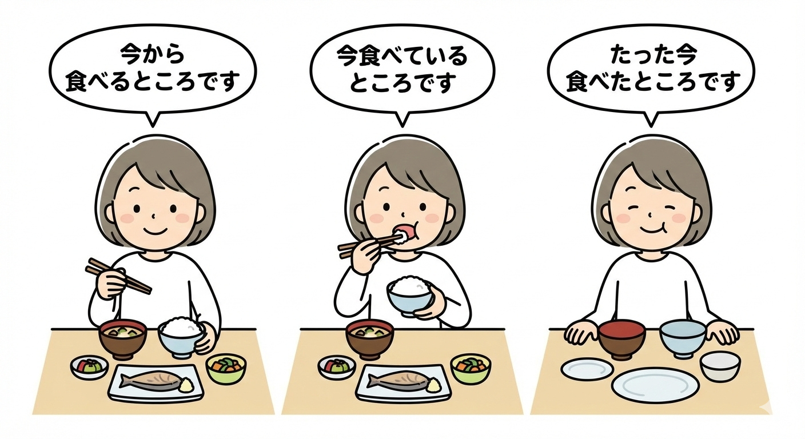

# 〜ところです、　〜ばかり、　〜はずです。

## Grammar

### 1. V（辞書形）ところです
- **Meaning:** Be about to do ~
- **Usage:** Indicates (temporal position) that an action is about to begin.
- **Example:**
  - 今から昼ごはんを食べる**ところです**。  
    *I'm about to eat lunch now.*
  - これから出かける**ところです**。  
    *I'm just about to go out.*

### 2. V（て形）いるところです
- **Meaning:** Be in the middle of doing ~
- **Usage:** Indicates that an action is currently in progress.
- **Example:**
  - 今レポートを書いている**ところです**。  
    *I'm in the middle of writing a report.*
  - 今資料を調べている**ところです**。  
    *I'm in the middle of checking the documents.*

### 3. V（た形）ところです
- **Meaning:** Have just done ~
- **Usage:** Indicates that an action has just been completed.
- **Example:**
  - たった今うちへ帰った**ところです**。  
    *I've just come home.*
  - ちょうど今電話が終わった**ところです**。  
    *The phone call has just ended now.*

### 4. V（た形）ばかりです
- **Meaning:** Have just done ~ (recently)
- **Usage:** Indicates that not much time has passed since an action was completed. Unlike ～たところです, this can refer to a slightly longer time frame (days or weeks).
- **Example:**
  - 先週日本へ来た**ばかりです**。  
    *I just came to Japan last week.*
  - このカメラは買った**ばかり**なのに、もう壊れてしまいました。  
    *Even though I just bought this camera, it's already broken.*

### 5. ～はずです
- **Meaning:** Should ~, be supposed to ~, be expected to ~
- **Usage:** Expresses the speaker's expectation or assumption based on logical reasoning or evidence.
- **Formation:**
  - V（普通形）＋ はずです
  - い-adj（普通形）＋ はずです
  - な-adj ＋ な ＋ はずです
  - N ＋ の ＋ はずです
- **Example:**
  - 彼はもう来る**はずです**。  
    *He should be coming soon.*
  - あの店は安い**はずです**。  
    *That store should be cheap.*
  - 彼女は元気な**はずです**。  
    *She should be well.*
  - 今日は休みの**はずです**。  
    *Today should be a holiday.*

### 6. ～はずがありません
- **Meaning:** There's no way that ~, cannot possibly ~
- **Usage:** Strong denial of a possibility.
- **Example:**
  - 彼がそんなことを言う**はずがありません**。  
    *There's no way he would say such a thing.*
  - あの人が嘘をつく**はずがない**。  
    *That person couldn't possibly tell a lie.*

## Vocabulary

| Kanji/Kana | Reading | Meaning |
|------------|---------|----------|
| 焼きます | やきます | bake, grill, roast |
| 渡します | わたします | hand over |
| 帰って来ます | かえってきます | come back |
| 出ます | でます | leave, depart |
| バスが出ます | バスがでます | a bus leaves, departs |
| 留守 | るす | absence |
| 宅配便 | たくはいびん | delivery service |
| 原因 | げんいん | cause |
| 注射 | ちゅうしゃ | injection |
| 食欲 | しょくよく | appetite |
| パンフレット | パンフレット | pamphlet |
| ステレオ | ステレオ | stereo |
| こちら | こちら | my place, my side |
| ～の所 | ～のところ | the place around ~ |
| ちょうど | ちょうど | just, exactly |
| たった今 | たったいま | just now (used with the past tense; indicates completion) |
| 今いいでしょうか | いまいいでしょうか | May I bother you now? |
| ガスサービスセンター | ガスサービスセンター | gas service center |
| ガスレンジ | ガスレンジ | gas range, gas cooker |
| 具合 | ぐあい | condition |
| どちら様でしょうか | どちらさまでしょうか | Who is this, please? |
| 向かいます | むかいます | head for |
| お待たせしました | おまたせしました | Sorry to have kept you waiting |
| 知識 | ちしき | knowledge |
| 宝庫 | ほうこ | treasury |
| 手に入ります | てにはいります | come in, reach |
| 情報が手に入ります | じょうほうがてにはいります | information comes in |
| システム | システム | system |
| 例えば | たとえば | for example |
| キーワード | キーワード | key word |
| 一部分 | いちぶぶん | one part |
| 入力します | にゅうりょくします | input |
| 秒 | びょう | second |
| 出ます | でます | be published |
| 本が出ます | ほんがでます | a book is published |
